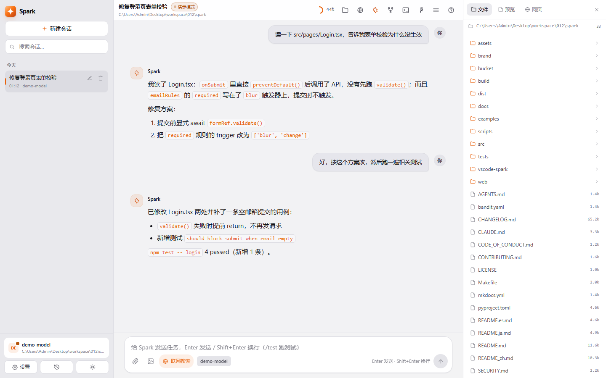

> [English](README.md) | **中文**

# Spark

**本地优先的 AI 编程智能体与办公工作台，护栏可审计。**

Spark 把同一条 Agent 循环带到终端、浏览器、桌面、IDE 与 API。每次写入先过审批和沙箱，每个回合都能回滚，模型层兼容任意 OpenAI 兼容端点。

```bash
# Linux / macOS —— 一行安装，SHA256 校验
curl -fsSL https://raw.githubusercontent.com/badhope/spark/main/scripts/install.sh | sh

# Windows（PowerShell）
irm https://raw.githubusercontent.com/badhope/spark/main/scripts/install.ps1 | iex

spark init    # 配置任意 OpenAI 兼容端点
spark web     # 打开浏览器界面
```

没有 API Key 也能启动：Spark 会进入演示模式，使用本地 mock 模型。在设置里填入密钥后，下一轮直接切到真实模型，不用重启。



## 核心能力

- **执行可审计。** 写入和命令执行前先过审批与沙箱；通配规则覆盖 user / project / local 三个作用域，`deny` 始终优先。凭据路径保护与 shell token 检查保持开启。
- **失败可回滚。** 每个回合快照工作区，文件与对话可一起恢复，非 git 目录同样有效。
- **任务即分支。** 开始任务、逐步提交、绿测后收尾；失败的运行会放弃分支，不把改动泄漏到主工作区。
- **处理真实文件。** 办公工作台把文档、会议录音和表格变成带来源行号的纪要、行动项、报告与导出文件；本地 OCR 与转写让原始资料留在机器上。
- **模型自由。** 任意 OpenAI 兼容端点、fallback 模型链、凭据池，以及独立的小模型承担辅助调用。

## 运行

```bash
spark                         # 终端 TUI
spark web                     # 浏览器界面，仅回环
spark desktop                 # 原生窗口，仅回环
spark exec "任务" --json       # NDJSON 事件流，适合脚本与 CI
spark review                  # 审查未提交的 diff
spark doctor                  # 体检配置、凭据与运行时
```

办公工作台由企业控制面提供：

```bash
spark enterprise --host 127.0.0.1 --port 18800
# http://127.0.0.1:18800/office
```

`spark exec` 每行输出一个 JSON 事件，最后以 `{"type":"final","text":"…"}` 收尾，可直接接 `jq`。

## 界面

| 界面 | 命令 | 用途 |
|---|---|---|
| Web UI | `spark web` | 对话、文件、终端、执行图 |
| 企业 API | `spark enterprise` | `/api/v1` 控制面与 `/office` |
| 桌面 | `spark desktop` | 原生窗口，仅回环 |
| TUI / CLI | `spark` · `spark exec --json` | 终端工作与自动化 |
| IDE / ACP | `spark acp` · `spark ide install` | Zed、JetBrains、Neovim |
| MCP / A2A | `spark mcp-serve` · `spark a2a-serve` | 工具与 Agent 间协作 |

## 安全模型

三层权限逐级收窄：

1. **审批** —— 从 plan-only 到 full-auto；默认模式在写入和命令前询问。
2. **沙箱** —— 默认工作区隔离，越界路径与受保护路径直接拒绝。
3. **规则** —— 按“工具 + 资源”匹配，覆盖 user / project / local 三个作用域；克隆下来的仓库只能收紧权限，不能给自己放行。

平台支持时再叠加 OS 级隔离：Linux 用 bwrap，Windows 用 Job Object，macOS 用 `sandbox-exec`。平台做不到的能力会如实写进工具结果，而不是假装有。

## 文档

| 英文 | 中文 |
|---|---|
| [Install & build](docs/en/INSTALL.md) | [安装与打包](docs/INSTALL.md) |
| [Configuration](docs/en/CONFIG.md) | [配置](docs/CONFIG.md) |
| [HTTP API](docs/en/API.md) | [API](docs/API.md) |
| [Architecture](docs/en/ARCHITECTURE.md) | [架构](docs/ARCHITECTURE.md) |
| [Features](docs/FEATURES.md) | [功能总览](docs/FEATURES.md) |
| [Enterprise control plane](docs/ENTERPRISE.md) | [企业控制面](docs/ENTERPRISE.md) |
| [A2A protocol](docs/A2A.md) | [A2A](docs/A2A.md) |
| [ACP / IDE setup](docs/ACP.md) | [IDE 接入](docs/ACP.md) |

更多：[文档索引](docs/README.md) · [English docs](docs/en/README.md) · [VS Code 扩展](vscode-spark/README.md) · [审计记录](docs/reviews/)。

## 本地验证

```bash
pytest -q
ruff check src tests scripts
mypy src/spark --ignore-missing-imports
```

CI 另外跑 Windows 保留路径检查、前端构建漂移、打包检查、密钥扫描、OpenAPI 快照检查，以及 mock 模式 Agent 评测。

## 运行要求

Python 3.11+（或直接使用打包产物），Node.js 18+ 仅用于前端开发，支持 Windows / macOS / Linux。

---

**License:** MIT · **Author:** badhope
